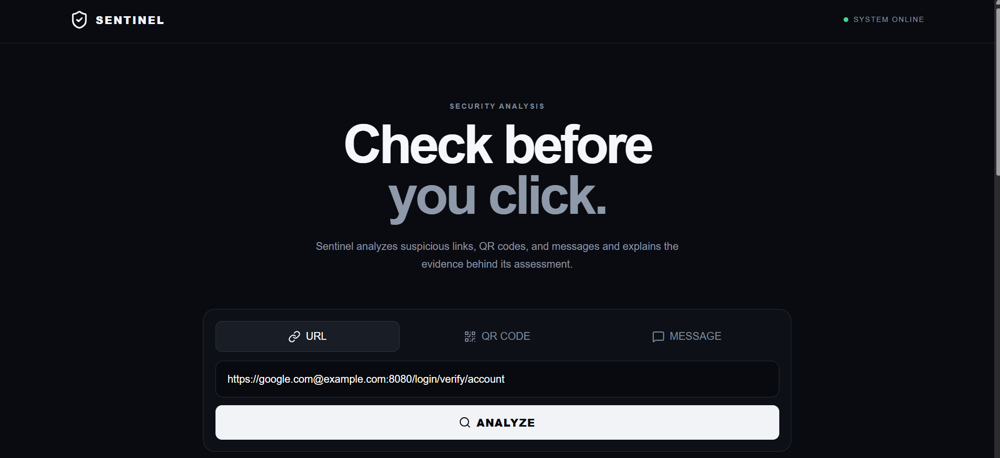
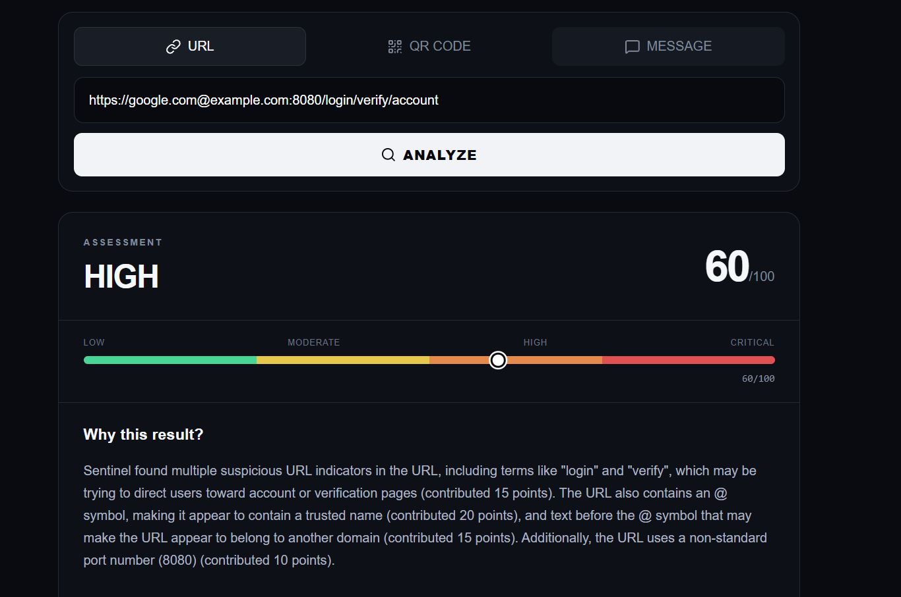
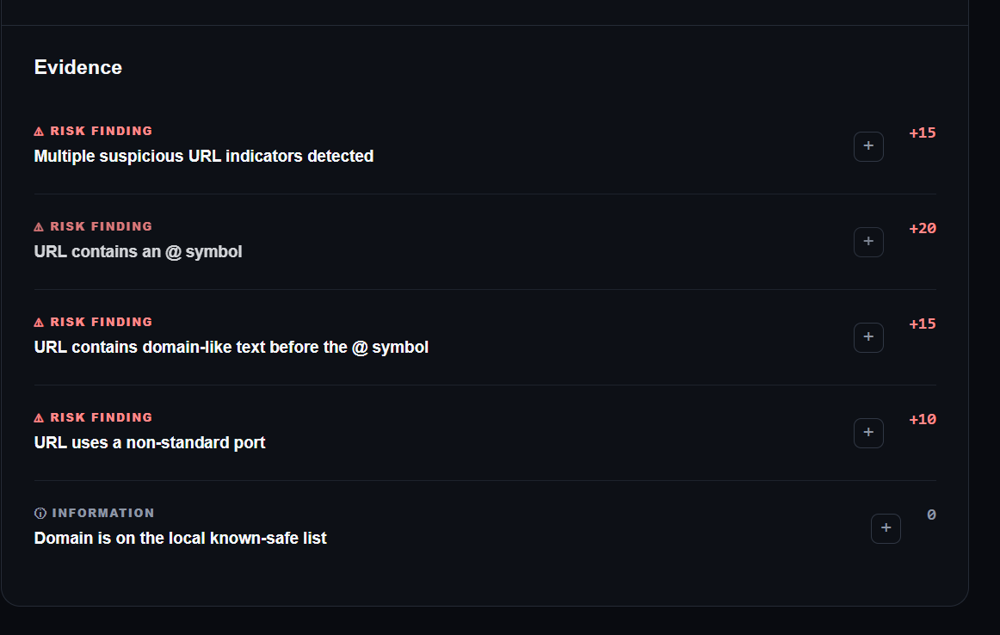

# Sentinel

### AI Security Interpreter

> **Sentinel doesn't just tell you whether something is suspicious. It shows you why.**

Sentinel is a security analysis tool that analyzes suspicious **URLs, QR codes, and messages** and explains the evidence behind its risk assessment in plain language.

The security engine performs deterministic analysis and calculates the risk score. A local AI model then explains those findings to the user.

## Dashboard



## Security Analysis



## Detailed Analysis



---

## The Problem

Suspicious links are everywhere.

A URL can look legitimate while containing unusual patterns, misleading structures, or other indicators that deserve closer inspection. QR codes can hide the destination entirely, while suspicious messages can make it difficult for users to identify which links deserve attention.

Many security tools provide a simple verdict without clearly explaining the evidence behind it.

Sentinel focuses on making the analysis understandable.

---

## The Solution

Sentinel accepts three types of input:

* 🔗 URLs
* 📱 QR code images
* 💬 Messages containing URLs

It analyzes the input using multiple security checks, collects the resulting evidence, calculates a deterministic risk score, and presents the findings in a human-readable report.

The local AI model is used as an **explanation layer**, not as the security decision-maker.

---

## Features

### URL Analysis

Sentinel currently checks for indicators including:

* HTTP instead of HTTPS
* Direct IP addresses
* Suspicious URL patterns
* Unusually long URLs
* `@` symbols in URLs
* Domain-like text before an `@` symbol
* Multiple subdomains
* Non-standard ports
* Domain reputation information

### QR Code Analysis

Users can upload a QR code image.

Sentinel:

1. Decodes the QR code
2. Extracts the destination URL
3. Sends the URL through the security analyzer
4. Displays the resulting assessment and evidence

### Message Analysis

Users can paste a suspicious message.

Sentinel extracts URLs from the message and analyzes them using the same URL security engine.

### Explainable Risk Assessment

Every finding contains information such as:

* Category
* Severity
* Finding
* Explanation
* Risk contribution
* Supporting details where available

Users can expand individual findings to see more information.

### Local AI Explanation

Sentinel uses a locally running Llama model through Ollama.

The AI receives the evidence generated by the security engine and converts it into simple language.

The AI does **not**:

* Calculate the risk score
* Change the risk level
* Add security findings
* Invent evidence

---

## How Sentinel Works

```text
                    USER INPUT
                        │
          ┌─────────────┼─────────────┐
          ▼             ▼             ▼
         URL           QR CODE       MESSAGE
                        │             │
                        │         URL EXTRACTION
                        │             │
                        ▼             ▼
                  ┌─────────────────────┐
                  │   SECURITY ENGINE   │
                  │                     │
                  │ URL Structure       │
                  │ Connection          │
                  │ Hostname            │
                  │ Reputation          │
                  └──────────┬──────────┘
                             │
                             ▼
                         EVIDENCE
                             │
                             ▼
                      RISK SCORING
                         0–100
                             │
                             ▼
                       RISK LEVEL
                  LOW / MODERATE / HIGH
                         / CRITICAL
                             │
                             ▼
                       LOCAL AI
                     EXPLANATION
                             │
                             ▼
                    HUMAN-READABLE
                        REPORT
```

### Core Design Principle

> **AI explains the assessment. It does not make the assessment.**

The risk score is calculated by Sentinel's deterministic security engine.

The AI receives the resulting evidence and explains it.

This separation helps make the security assessment transparent and reproducible.

---

## Risk Scoring

Sentinel uses a deterministic scoring system.

Individual findings can contribute points to the overall score.

The score is constrained to a range of **0–100**.

Current risk levels:

|  Score | Risk Level |
| -----: | ---------- |
|   0–24 | LOW        |
|  25–49 | MODERATE   |
|  50–74 | HIGH       |
| 75–100 | CRITICAL   |

For example, a URL using an IP address can contribute risk points, while an informational reputation result contributes **0 points**.

The score is calculated independently of the AI explanation.

---

## Reputation Analysis

Sentinel can query VirusTotal for domain reputation information when a VirusTotal API key is configured.

Reputation results are treated as evidence and incorporated into the deterministic scoring system according to the result returned by the reputation service.

If reputation information is unavailable, Sentinel does not invent a result.

---

## Technology Stack

### Backend

* Python
* Flask
* Flask-CORS
* OpenCV
* Requests
* Ollama

### Frontend

* React
* TypeScript
* Vite
* Lucide React
* CSS

### Security / Analysis

* Deterministic rule-based analysis
* URL parsing
* QR code decoding
* Domain reputation analysis
* Explainable evidence generation
* Local Llama AI explanation

---

## Project Structure

```text
Sentinal/
│
├── backend/
│   ├── analyzers/
│   │   ├── message_analyzer.py
│   │   ├── qr_analyzer.py
│   │   └── url_analyzer.py
│   │
│   ├── security/
│   │   ├── ai_context.py
│   │   ├── evidence.py
│   │   └── scoring.py
│   │
│   ├── services/
│   │   ├── ai.py
│   │   └── reputation.py
│   │
│   ├── tests/
│   │   └── test_url_analyzer.py
│   │
│   └── app.py
│
├── frontend/
│   ├── src/
│   │   ├── App.tsx
│   │   ├── index.css
│   │   └── main.tsx
│   │
│   ├── package.json
│   └── package-lock.json
│
├── requirements.txt
├── .gitignore
└── README.md
```

---

## Installation

### 1. Clone the repository

```bash
git clone https://github.com/nightslayer55/Sentinel.git
cd Sentinal
```

### 2. Install Python dependencies

```bash
pip install -r requirements.txt
```

### 3. Configure VirusTotal

Create a `.env` file in the project environment and configure your VirusTotal API key.

The API key should never be committed to Git.

### 4. Install frontend dependencies

```bash
cd frontend
npm install
```

---

## Running Sentinel

### Start the backend

From the `backend` directory:

```bash
python app.py
```

The Flask API runs on:

```text
http://127.0.0.1:5000
```

### Start the frontend

From the `frontend` directory:

```bash
npm run dev
```

Vite will provide the local development address.

---

## Testing

Sentinel includes automated tests for the URL analysis engine.

Run:

```bash
pytest
```

The current test suite contains **13 passing tests** covering URL validation, scoring, IP detection, suspicious patterns, URL structure, ports, and evidence generation.

---

## Security Design

Sentinel follows a separation-of-responsibilities approach:

```text
Security Engine
      │
      ├── Finds indicators
      ├── Produces evidence
      └── Calculates score
               │
               ▼
             AI
               │
               └── Explains evidence
```

This means the AI is not trusted to independently determine whether a URL is malicious.

The deterministic engine remains responsible for the actual assessment.

---

## Current Limitations

Sentinel is an analysis and educational security tool and should not be treated as a definitive security verdict.

Current limitations include:

* Reputation data depends on external reputation services.
* Unknown domains cannot automatically be considered safe or malicious.
* URL heuristics can produce false positives or false negatives.
* Message analysis currently focuses on extracting URLs.
* QR analysis depends on successful QR decoding.
* Sentinel does not currently perform full webpage or JavaScript analysis.
* The local AI explanation depends on the availability of the configured Ollama model.

A LOW score does not guarantee that a URL is safe.

---

## Future Improvements

Potential future development includes:

* Redirect-chain analysis
* Domain-age information
* Additional reputation sources
* More advanced message analysis
* Analysis history
* Improved mobile experience
* Additional URL security indicators
* Expanded automated test coverage

---

## Project Status

**Current status: MVP**

Implemented:

* URL security analysis
* Explainable evidence
* Deterministic risk scoring
* QR code analysis
* Message URL extraction
* VirusTotal reputation integration
* Local AI explanations
* React/TypeScript frontend
* Automated testing

---

## Philosophy

Security tools should not only produce answers.

They should help people understand **why** an answer was produced.

**Sentinel makes the evidence visible.**
